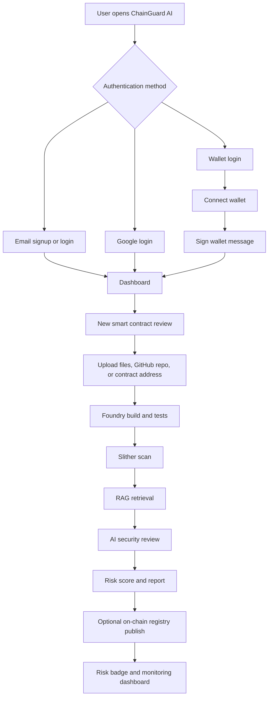
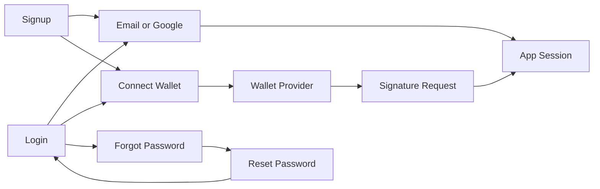
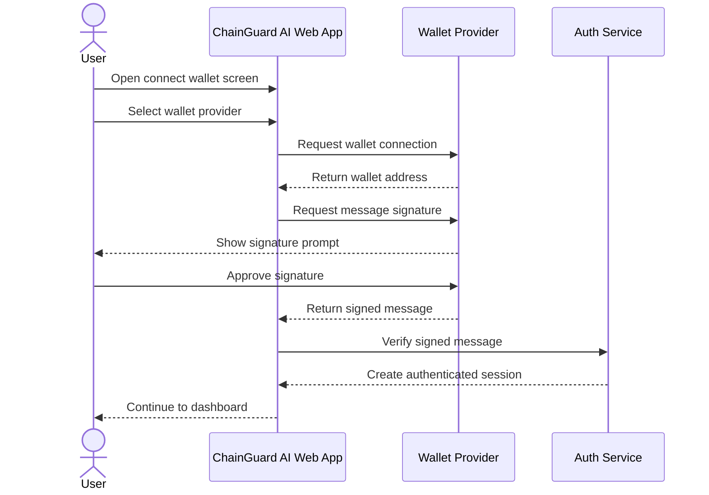
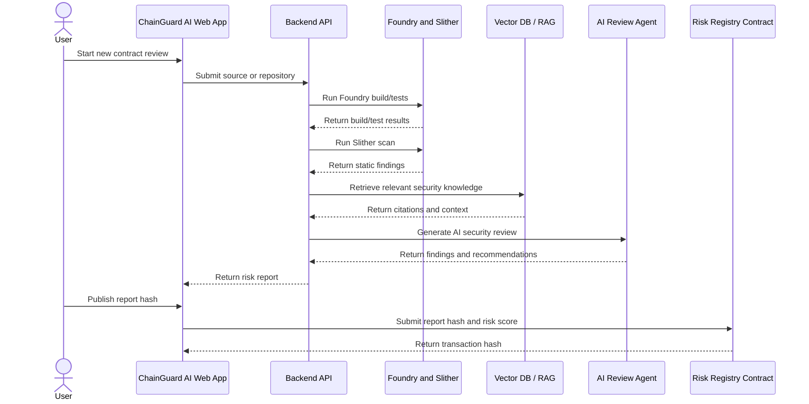

# ChainGuard AI

ChainGuard AI is a smart contract security platform concept that combines AI-assisted review, static analysis, wallet-based identity, and on-chain risk intelligence.

The long-term goal is to build an AI Smart Contract Review Agent that can review Solidity projects, call security tools such as Slither and Foundry, retrieve security knowledge through RAG, generate risk reports, and optionally publish verifiable risk metadata to an on-chain registry.

## Current Status

This repository currently contains the frontend foundation for the authentication experience.

Implemented UI screens:

- Signup
- Login
- Forgot password
- Reset password
- Connect wallet
- Wallet signature request

Implemented frontend patterns:

- Next.js App Router
- Route groups for auth pages
- Shared auth layout pattern
- Reusable auth components
- Dark enterprise security UI
- Emerald primary action system
- Wallet brand icons for MetaMask, Coinbase Wallet, and WalletConnect

## Product Idea

ChainGuard AI is designed for Web3 teams, auditors, and protocol developers who need a faster way to review smart contracts before deployment.

The platform will allow users to:

- Sign in with Web2 or Web3 authentication
- Upload Solidity files or connect a GitHub repository
- Run Foundry build and tests
- Run Slither static analysis
- Ask an AI security chatbot questions about a contract
- Retrieve trusted security knowledge using RAG
- Generate a structured AI review report
- Calculate a risk score
- Publish report hashes or risk badges to an on-chain registry
- Monitor AI review latency, tool failures, token cost, and retrieval quality

## High-Level Flow



## Auth Flow



## Simple SSD

System Sequence Diagram for wallet-based authentication:



System Sequence Diagram for future smart contract review:



## Tech Stack

- Next.js
- React
- TypeScript
- Tailwind CSS
- pnpm workspaces
- Web3 wallet icon system using `@web3icons/react`

Planned stack:

- FastAPI backend
- Foundry
- Slither
- RAG pipeline
- Vector database
- LLM tool calling
- Docker
- MLflow or equivalent experiment tracking
- Monitoring dashboard
- Smart contract risk registry

## Repository Structure

```txt
chainguard-ai/
  apps/
    web/
      src/
        app/
          (auth)/
            signup/
            login/
            forgot-password/
            reset-password/
            connect-wallet/
            wallet-signature/
          globals.css
          layout.tsx
          page.tsx
        components/
          auth/
            auth-button.tsx
            auth-card.tsx
            auth-divider.tsx
            auth-icons.tsx
            auth-input.tsx
            auth-logo.tsx
            auth-shell.tsx
  package.json
  pnpm-workspace.yaml
```

## Getting Started

Install dependencies:

```bash
pnpm install
```

Run the web app:

```bash
pnpm dev:web
```

Open:

```txt
http://localhost:3000
```

Run lint:

```bash
pnpm lint:web
```

Build the web app:

```bash
pnpm build:web
```

## Git Workflow

Daily development flow:

```bash
git status
pnpm lint:web
git add .
git commit -m "Describe the completed work"
git push
```

First push to GitHub:

```bash
git branch -M main
git remote add origin https://github.com/awaisahmadfg/chainguard-ai.git
git push -u origin main
```

If the remote already exists:

```bash
git remote set-url origin https://github.com/awaisahmadfg/chainguard-ai.git
git push -u origin main
```

## Roadmap

- Add email verification screen
- Add first-time onboarding screen
- Add dashboard home screen
- Add new smart contract review flow
- Add analysis progress screen
- Add review report detail screen
- Add AI security chatbot UI
- Add on-chain risk registry UI
- Add risk badge generator
- Add monitoring dashboard
- Add backend API
- Add Foundry and Slither tool execution
- Add RAG pipeline
- Add AI agent tool-calling workflow
- Add Docker deployment
- Add monitoring and evaluation metrics

## Learning Goals

This project is also being built as a learning roadmap for production AI and Web3 development:

- Advanced Next.js frontend architecture
- Clean reusable UI components
- Web2 and Web3 authentication flows
- Smart contract security review workflows
- Foundry testing and build pipelines
- Slither static analysis integration
- RAG fundamentals
- AI agent tool calling
- MLOps and monitoring
- Production deployment practices

