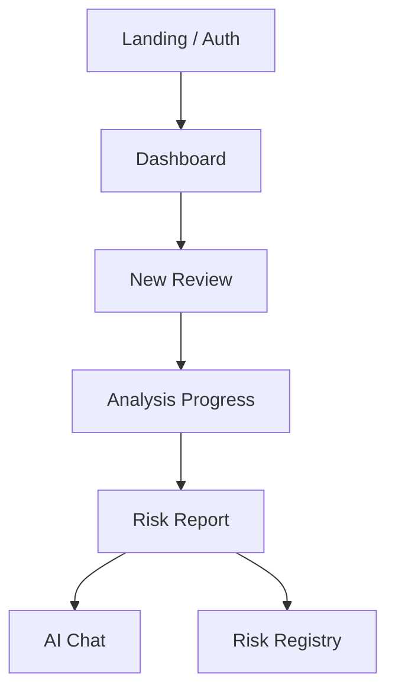

# ChainGuard AI

**Hackathon prototype** — a clickable frontend for an AI smart-contract review agent.

Reviewers can walk the full product loop without a backend: auth → new review → analysis progress → risk report → AI chat → on-chain risk registry. Analysis, chat, and registry data are **demo-mocked** so the UI is fully explorable in minutes.

> Backend (Foundry / Slither / RAG / real wallets) is intentionally out of scope for this prototype. That is expected for a short hackathon build.

## Quick start (judges)

```bash
pnpm install
pnpm dev:web
```

Open [http://localhost:3000](http://localhost:3000)

1. Click **Enter live demo** on the landing page (skips login).
2. Follow the green **Judge / first-run tour** on the dashboard.
3. Or record the flow in [`DEMO.md`](./DEMO.md) (≤ 3 minute script).

Any email/password on login/signup also creates a local demo session cookie and continues.

## What this prototype demonstrates

| Area | What you can click |
|------|--------------------|
| Landing | Problem framing + one-click demo entry |
| Auth | Signup, login, forgot/reset password, connect wallet, signature request |
| Dashboard | Stats, recent reviews, tour banner |
| New Review | GitHub / upload / address, chain select, Foundry·Slither·RAG pipeline toggles |
| Progress | Simulated multi-step analysis pipeline |
| Reports | Risk score, severity, findings, recommended fix, PDF export UI |
| AI Chat | Mock security agent with suggested prompts + code context |
| Risk Registry | Filters, contract drawer, CSV export, verification actions |
| Settings | Profile, auth methods, API credentials, org structure (UI) |

## Honest scope

**Included**

- Complete Next.js App Router UI
- Demo session cookie + middleware-protected `/dashboard/*`
- Mock review / report / chat / registry data
- Judge tour + demo video beat sheet

**Not included (planned)**

- Real OAuth / wallet cryptography
- FastAPI (or other) backend
- Live Foundry / Slither execution
- Real RAG + LLM tool calling
- On-chain registry transactions

Findings in this build are **illustrative**, not audit advice.

## Product vision

ChainGuard AI targets Web3 teams who need faster security feedback before a full audit: upload or connect a repo, run tool-assisted analysis, ask an AI agent about findings, and optionally publish verifiable risk metadata on-chain.



## Tech stack

- Next.js (App Router) · React · TypeScript · Tailwind CSS
- pnpm workspaces (`apps/web`)
- react-hook-form + zod (forms)
- `@web3icons/react` (wallet icons)

## Repository layout

```txt
chainguard-ai/
  DEMO.md                 # ≤3 min demo video script
  README.md
  apps/web/
    src/app/
      page.tsx            # Landing + Enter live demo
      (auth)/             # Login, signup, wallet, privacy, terms…
      dashboard/          # Overview, review, reports, chat, registry, settings
    src/components/       # Auth, dashboard, review, chat, registry, demo
    src/lib/              # Mock data + session helpers
```

## Scripts

```bash
pnpm install          # install deps
pnpm dev:web          # http://localhost:3000
pnpm lint:web         # eslint
pnpm build:web        # production build
```

## Suggested review path (3 minutes)

1. Landing → **Enter live demo**
2. Dashboard tour → **Start a review** → submit
3. Watch progress → open report → export PDF (UI)
4. **AI Chatbot** → use a suggested prompt
5. **Risk Registry** → open a contract → export CSV

## Roadmap (post-hackathon)

- Wire email / Google / wallet auth for real
- Backend API + Foundry / Slither runners
- RAG retrieval + LLM tool-calling agent
- Publish report hash / risk badge on-chain
- Monitoring (latency, tool failures, token cost)

## License / notice

Prototype for hackathon evaluation. Not a production security product.
